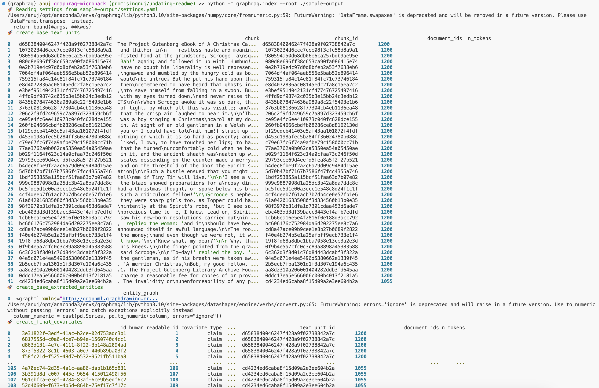
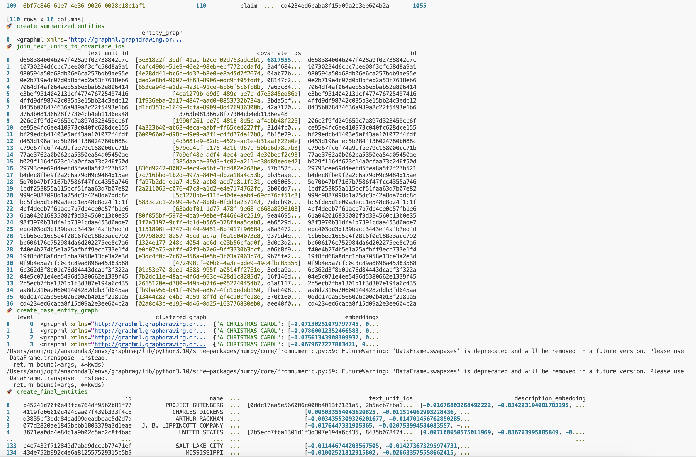
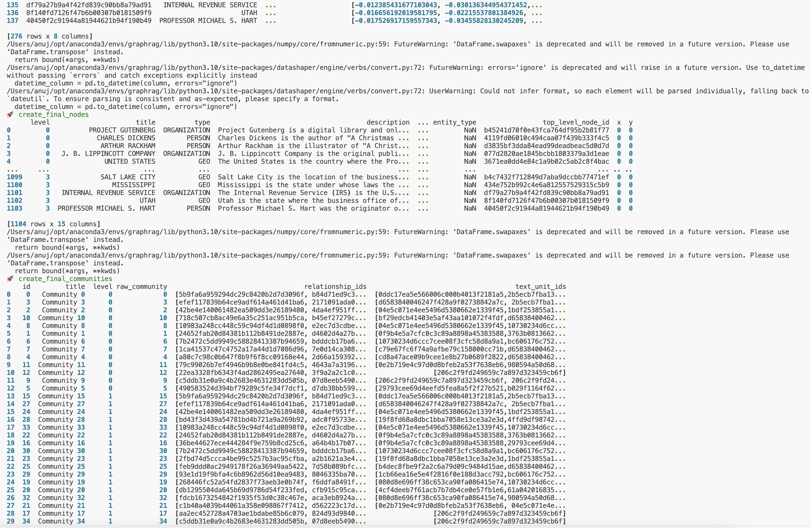
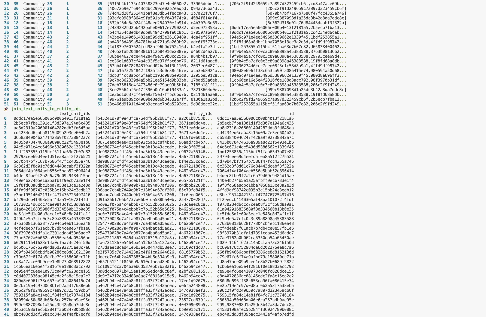
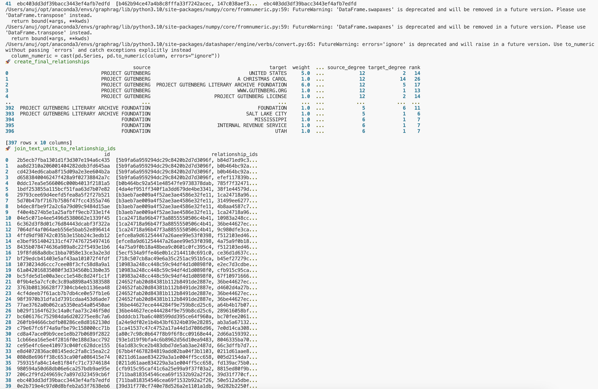
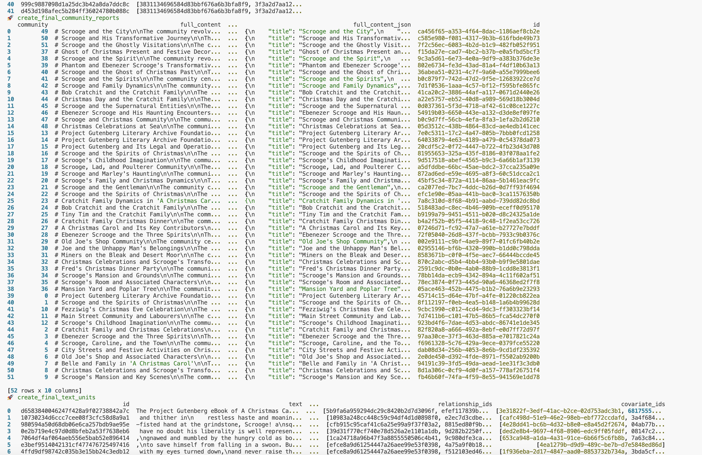
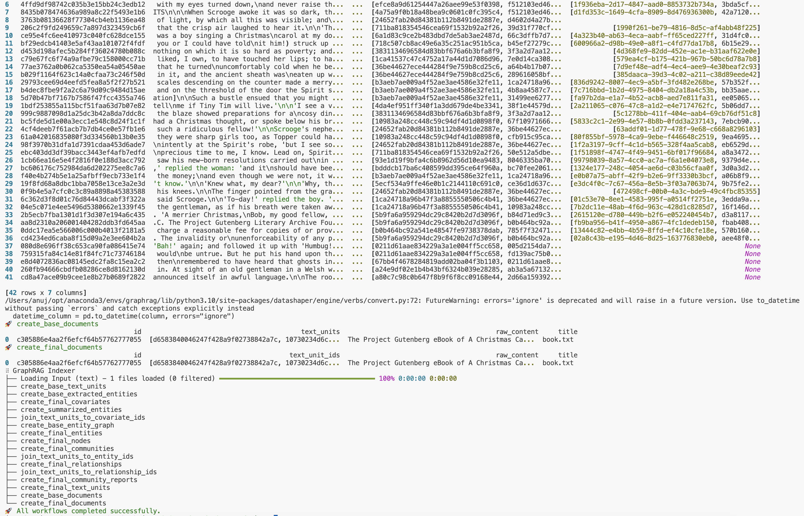

# Microsoft GraphRAG Microhack <!-- omit in toc -->

## Contents <!-- omit in toc -->

- [Software prerequisites](#software-prerequisites)
- [GraphRAG initialization and indexation process](#graphrag-initialization-and-indexation-process)
  - [Steps to follow](#steps-to-follow)
- [Using the query engine](#using-the-query-engine)
  - [Performing local search](#performing-local-search)
  - [Performing global search](#performing-global-search)
- [Understanding the indexing pipeline output](#understanding-the-indexing-pipeline-output)
  - [Understanding the output files](#understanding-the-output-files)
  - [Visualizing the graph](#visualizing-the-graph)
  - [Local and global search](#local-and-global-search)
- [References](#references)
- [Acknowledgements](#acknowledgements)
- [License](#license)

## Software prerequisites

- Latest version of [Docker Desktop](https://www.docker.com/products/docker-desktop/)
- [VSCode](https://code.visualstudio.com/)
- [Visual Studio Code Remote Development Extension](https://marketplace.visualstudio.com/items?itemName=ms-vscode-remote.vscode-remote-extensionpack)

It is strongly recommended to use dev container to avoid python packages dependencies.

## GraphRAG initialization and indexation process

If you want to run the indexing process on your local machine to gain a better understanding of how GraphRAG works, you can follow the steps belows. Please note that these steps are well described in the original documentation at https://microsoft.github.io/graphrag/posts/get_started/. However, we have provided a brief overview of the steps below.

If you don't want to run the indexing process, please move to the next section to [understand the output](#understanding-the-output).

### Steps to follow

1. Clone the repo to your local machine (or Download as zip and extract):

   ```bash
   git clone https://github.com/promisinganuj/graphrag-microhack.git
   ```

1. You have two options for running this: either through Dev Containers or within a local virtual environment.

   - __Dev Container approach__:
     Open the project inside the vscode dev container. For that open the command palette (`Ctrl+Shift+P`) and search for `Dev Containers: Open Folder in Container...`. Select the root folder and confirm.

     ** _If you are using MAC with Apple Silicon chip (M1/M2/M3), please ensure that you have the latest version of Docker Desktop installed to avoid the hard requirement to install Rosetta 2. This dependency is removed from  Docker Desktop 4.3.0 onwards. Check [here](https://docs.docker.com/desktop/install/mac-install/) for more details._

   - __Virtual environment approach__:
     Within vscode terminal, go to the root directory of this repo. Create a virtual environment, activate it and install all necessary libraries
     ```python
      # step 1: Create virtual environment
      python -m venv .venv

      # step 2: Activate virtual environment
        # in linux/mac environments
        source .venv/bin/activate
        # in Windows
        .venv\Scripts\activate

      # step 3: Install required python libraries
      pip install -r requirements.txt
      ```

1. Choose a root directory called `sample` (or anything else), and create an `input` folder within it.

   ```bash
   mkdir -p ./sample/input
   ```

   This will install the required packages for running the indexing process.

1. For running out the indexation process, you can use any dataset of your choice. As a sample, we have provided a copy of [A Christmas Carol](./datasets/books/a-christmas-carol.txt) by Charles Dickens from [Project Gutenburg](https://www.gutenberg.org). You can use this dataset to run the indexing process.

   Copy the `a-christmas-carol.txt` file to the `./sample` directory by using the following command:

   ```bash
   cp ./datasets/books/a-christmas-carol.txt ./sample/input/
   ```

1. Initialize graphrag by running the following command:

   ```bash
   python -m graphrag.index --init --root ./sample
   ```

1. Setup workspace variables

   This will create two files: .env and settings.yaml in the ./sample directory.

   The `.env` file contains the environment variables required to run the GraphRAG pipeline. If you inspect the file, you'll see a single environment variable defined, `GRAPHRAG_API_KEY=<API_KEY>`. This is the API key for the OpenAI API or Azure OpenAI endpoint. You can replace this with your own API key.

   The `settings.yaml` file contains the settings for the pipeline. You can modify this file to change the settings for the pipeline.

   __OpenAI and Azure OpenAI__
   To run in OpenAI mode, just make sure to update the value of `GRAPHRAG_API_KEY` in the `.env` file with your OpenAI API key.

   __Azure OpenAI__
   In addition, Azure OpenAI users should set the following variables in the `settings.yaml` file. To find the appropriate sections, just search for the `llm: configuration`, you should see two sections, one for the chat endpoint and one for the embeddings endpoint. Here is an example of how to configure the chat endpoint:

   ```yaml
   type: azure_openai_chat # Or azure_openai_embedding for embeddings
   model: <azure_model_name>
   api_base: https://<instance>.openai.azure.com
   api_version: 2024-02-15-preview # You can customize this for other versions
   deployment_name: <azure_model_deployment_name>
   ```

   Please follow the [documentation](https://learn.microsoft.com/en-us/azure/ai-services/openai/how-to/create-resource?pivots=web-portal) for more information on how to set up the Azure OpenAI Service resource and deploy models.

1. Run the Indexing pipeline

   ```bash
   python -m graphrag.index --root ./sample
   ```

   This process will take some time to run. This depends on the size of your input data, what model you're using, and the text chunk size being used (these can be configured in your `.env` file). Once the pipeline is complete, you should see a new folder called `./sample/output/<timestamp>/artifacts` with a series of parquet files.

   Here are the screenshots of the output of a sample run:

   
   
   
   
   
   
   

## Using the query engine

Once the indexing is complete, you can use the [Query Engine](https://microsoft.github.io/graphrag/posts/query/overview/) to query the knowledge graph. The Query Engine is the retrieval module of the Graph RAG Library.

### Performing local search

To run a local search, you can use the following command:

```bash
python -m graphrag.query --root ./sample --method local "Who is Scrooge, and what are his main relationships?"
```

For details about the local search, please refer to the [local search documentation](https://microsoft.github.io/graphrag/posts/query/1-local_search/).

### Performing global search

To run a global search, you can use the following command:

```bash
python -m graphrag.query --root ./sample --method global "What are the top themes in this story?"
```

For details about the global search, please refer to the [local search documentation](https://microsoft.github.io/graphrag/posts/query/0-global_search/).

## Understanding the indexing pipeline output

### Understanding the output files

The output of the indexing process is stored in the `./sample/output/<timestamp>/artifacts` directory. For reference, we have provided a sample output in the [sample-output](./sample-output/output/20240812-215728/artifacts/) directory. Here is a brief overview of the output files:

```bash
create_base_documents.parquet               -
create_base_text_units.parquet              -
create_base_extracted_entities.parquet      -
create_base_entity_graph.parquet            -
create_final_communities.parquet            -
create_final_community_reports.parquet      -
create_summarized_entities.parquet          -
create_final_entities.parquet               -
create_final_nodes.parquet                  -
create_final_covariates.parquet             
create_final_relationships.parquet          -
create_final_text_units.parquet             -
create_final_documents.parquet              -
join_text_units_to_entity_ids.parquet       -
join_text_units_to_relationship_ids.parquet -
join_text_units_to_covariate_ids.parquet    -
stats.json                                  -
```

Please follow the [understanding-graphrag-output.ipynb](./notebooks/understanding-graphrag-output.ipynb) notebook to understand the content of the output files. The notebook provides step-by-step instructions and code cells to:

- Load the output files as pandas dataframes.
- Extract graphML data from the output files and saves it as files in [analysis/20240812-215728](./analysis/20240812-215728/) directory.
- Explain the content and relationship of the output files.

### Visualizing the graph

Please follow the [visualizing-graphrag-output.ipynb](./notebooks/visualizing-graphrag-output.ipynb) notebook to visualize the graph. The notebook provides step-by-step instructions and code cells to:

- Load and pre-process the text data.
- Reshape and load the knowledge graph data for visualization.
- Run graph enabled RAG queries against the knowledge graph
- Visualize the retrieved data as a graph

The notebook requires certain environment variables to be set. For that, please rename the `.env.sample` file in the [notebooks](./notebooks/) folder to `.env` and update the values of the following environment variables:

```bash
GRAPHRAG_API_KEY=
GRAPHRAG_API_BASE=https://<instance>.openai.azure.com/
GRAPHRAG_API_VERSION=2024-05-01-preview
GRAPHRAG_LLM_MODEL=
GRAPHRAG_LLM_DEPLOYMENT=
GRAPHRAG_EMBEDDING_MODEL=
GRAPHRAG_EMBEDDING_DEPLOYMENT=
```

### Local and global search
Please follow the [visualizing-graphrag-output.ipynb](./notebooks/visualizing-graphrag-output.ipynb) notebook to perform Local Search queries. Refer to the section titled 'Run local search on sample queries'.

Please follow the [global_search.ipynb](./notebooks/global_search.ipynb) notebook to perform Global Search queries. Refer to the section titled 'Run global search on sample queries'.

## References

- [Project GraphRAG](https://www.microsoft.com/en-us/research/project/graphrag/)
- [Microsoft GraphRAG Documentation](https://microsoft.github.io/graphrag/)
- [Microsoft GraphRAG Repo](https://github.com/microsoft/graphrag)
- [Microsoft GraphRAG Accelerator](https://github.com/Azure-Samples/graphrag-accelerator)

## Acknowledgements

- The developers of the Python libraries used for graph creation and visualization.
- The developers of the Microsoft's `graphrag` library.
- [Project Gutenburg](https://www.gutenberg.org) for the dataset.

## License

This project is licensed under the MIT License - see the [LICENSE](./LICENSE) file for details.
